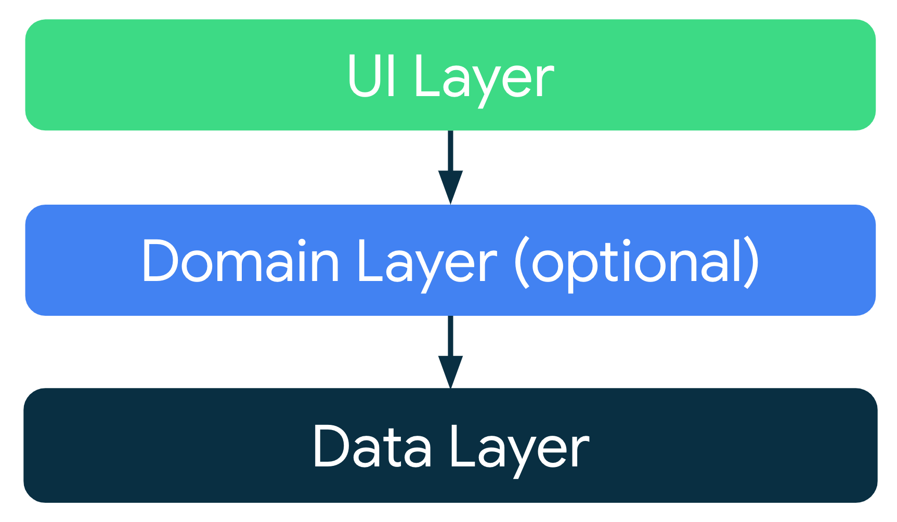
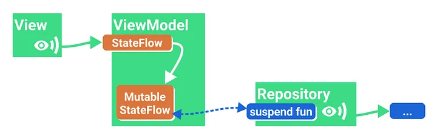

# ChatBot

Simple chat application where user send messages and a bot respond.
The response from the server arrives after a random delay.

## Architecture

I choose MVVM (Model-View-ViewModel) architecture. Why ?

* Well known and documented architecture, recommended by Android

* It allow decoupling the classes and dispatch the responsabilities among the layers
* It fit the purpose of the app : get user entry and fetch bot response from the network
* It fit with the UI framework choosed : Compose, thanks to the ViewModel class that handle the link between the UI and the repository
* No domain layer package because no need to do complex operations on the data coming from the data layer before displaying them
* Use of dependency injection with the Hilt library (recommended by Android doc) to respect the SOLID principle

The schema below represent how the result of the suspending function update a mutable value
and the UI. I use the same pattern in MainViewModel.kt for updating the conversation and the UI.

I choose Compose for the UI. Why Compose over classic xml ?
* It is the recommended way to build Android UI
* Perfect fit for MVVM architecture thanks to ViewModel class
* Fit well for a simple UI like this app
* Basic plumbing is handled (activity lifecycle, rotation, recreation, etc...)
* Display a chat can be seen as displaying a list of items. With Compose, no more need to write ListAdapters !

## Split the work

In a real work environment, I would have split this challenge into these tasks :

1. Choose an architecture
2. Define the data model and the interfaces between the layers
3. Define the dependency injection model
4. Write the repository layer implementation and the tests for the repository
5. Write the UI layer and the tests for the UI layer
6. Write the documentation

## To go further

What could have been done with more time :

* Catching network errors and add timeout on requests
* Cache network requests
* Displayed network errors/timeout to the user
* Create a new repository to save conversations (a Room database)
* Display the last conversation at first launch
* Make the server send several responses message to the user using Flow (cf. the dev_addBotResponsesAsFlow branch)
* Improved the bot responses
* Implement the addition of a loading state to simulate bot processing time (creating the impression that the bot is composing its response)
* Add tests for all of the above

## Time spent on the challenge

7h 